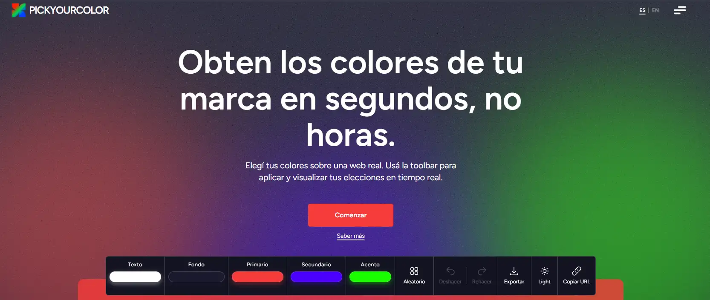

# PickYourColor



Visualizador interactivo de paletas de color que permite modificar y probar combinaciones en tiempo real sobre componentes de UI.

La aplicación está pensada para explorar contraste, armonía visual y comportamiento de un pequeño sistema de diseño modificando colores dinámicamente.

---

## Demo

https://pick-your-color-fi6u5v9bm-javier-alzus-projects.vercel.app/

Las paletas pueden compartirse mediante URL:

```
?colors=FFFFFF-1a1a2e-d1763c-86c350-4af27a
```

Esto permite guardar o enviar combinaciones de color fácilmente.

---

## Características

- Visualización de paleta aplicada a componentes de interfaz
- Modificación de colores en tiempo real
- Serialización de colores en la URL para compartir configuraciones
- Cálculo dinámico de contraste para mejorar legibilidad
- Componentes reutilizables con variantes visuales

---

## Stack

**Core**

- React
- Vite
- TypeScript

**UI**

- Tailwind CSS
- Radix UI primitives

**Estado**

- Zustand

**Testing**

- Vitest
- Testing Library

**Otros**

- tinycolor2 — manipulación y validación de colores
- react-colorful — color picker
- Sentry — monitoreo de errores
- Vercel Speed Insights — métricas de performance

---

## Desarrollo

Instalar dependencias

```bash
npm install
```

Correr el proyecto

```bash
npm run dev
```

Build de producción

```bash
npm run build
```

Preview del build

```bash
npm run preview
```

---

## Testing

```bash
npm run test
```

UI de tests

```bash
npm run test:ui
```

Coverage

```bash
npm run test:coverage
```

---

## Idea del proyecto

PickYourColor nació como una herramienta para experimentar rápidamente con combinaciones de color y ver cómo afectan a componentes reales de interfaz.

El objetivo es explorar paletas, contraste y jerarquía visual en tiempo real, simulando el comportamiento de un pequeño sistema de diseño.
